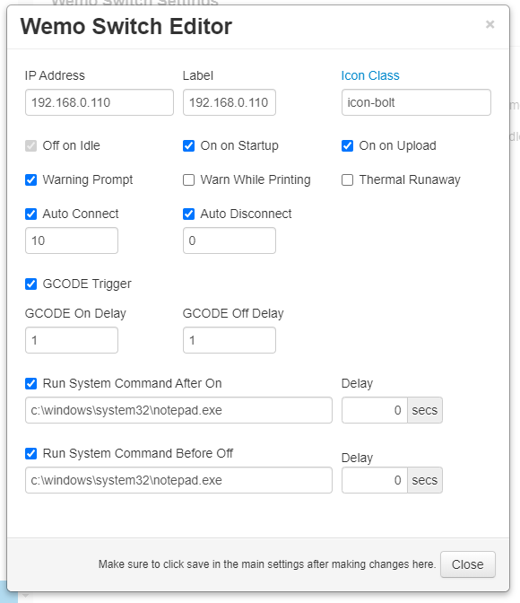

# Wemo Switch
    
This plugin allows for the control of Belkin Wemo devices via navbar buttons and gcode commands.

## Screenshots

## Settings

Once installed go into settings and enter the name of your wemo device. Adjust additional settings as needed.

- **IP Address**
  - The IP address of the wemo device.
- **Label**
  - Label to use for title attribute on hover over button in navbar.
- **Icon Class**
  - Class name from [fontawesome](http://fontawesome.io/3.2.1/cheatsheet/) to use for icon on button.
- **Warn**
  - The left checkbox will always warn when checked.
  - The right checkbox will only warn when printer is printing.
- **GCODE**
  - When checked this will enable the processing of M80 and M81 commands from gcode to power on/off plug.  Syntax for gcode command is M80/M81 followed by the plug's ip address.  For example if your plug's IP address is `192.168.0.104` your gcode command would be **M80 192.168.0.104**
  - Added with version 0.1.2 you can now use the custom action commands `@WEMOON` and `@WEMOOFF` followed by the IP address of the plug.  For example if your plug's IP address is 192.168.0.104 your gcode command would be **@WEMOON 192.168.0.104**.  This option will only work for plugs with GCODE processing enabled.
- **postConnect**
  - Automatically connect to printer after plug is powered on.
  - Will wait for number of seconds configured in **Auto Connect Delay** setting prior to attempting connection to printer.
- **preDisconnect**
  - Automatically disconnect printer prior to powering off the plug.
  - Will wait for number of seconds configured in **Auto Disconnect Delay** prior to powering off the plug.
- **Cmd On**
  - When checked will run system command configured in **System Command On** setting after a delay in seconds configured in **System Command On Delay**.
- **Cmd Off**
  - When checked will run system command configured in **System Command Off** setting after a delay in seconds configured in **System Command Off Delay**.
  
## Get Help

If you experience issues with this plugin or need assistance please use the issue tracker by clicking issues above.

### Additional Plugins

Check out my other plugins [here](https://plugins.octoprint.org/by_author/#jneilliii)

### Sponsors
- Andreas Lindermayr
- [@Mearman](https://github.com/Mearman)

### Support My Efforts
I, jneilliii, programmed this plugin for fun and do my best effort to support those that have issues with it, please return the favor and leave me a tip or become a Patron if you find this plugin helpful and want me to continue future development.

 

<small>No paypal.me? Send funds via PayPal to jneilliii&#64;gmail&#46;com</small>

